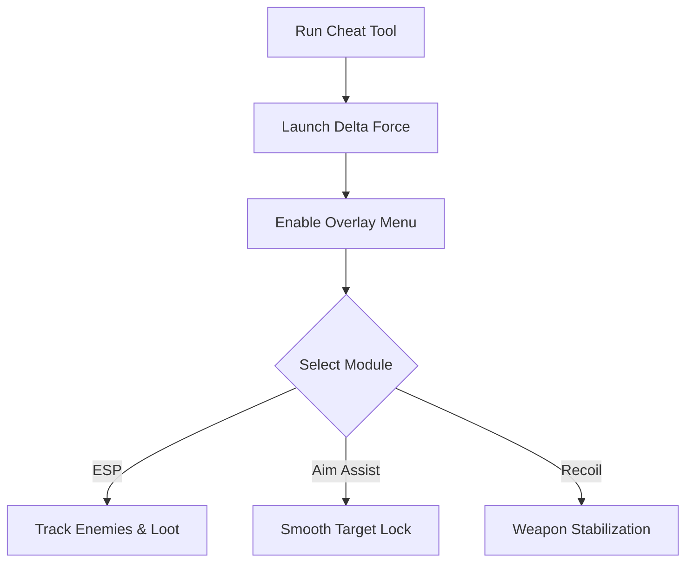

# Delta Force Cheat 🎯

The **Delta Force Cheat Software** is designed for players who want sharper precision and better awareness in tactical combat scenarios. With **ESP overlays, configurable aim tools, and resource boosts**, it lets you practice, explore, and refine strategies in private or offline sessions.

---

## 📝 Overview

Delta Force emphasizes teamwork and accuracy, but unpredictable firefights can turn the tide quickly. This cheat tool enhances awareness with **enemy ESP, loot highlights, and smooth aim assist**, giving you the ability to focus on tactical movement and coordinated assaults.

\[!WARNING]
For **offline and private training** only. It does not alter core game files.

[](https://delta-force-cheat-tool.github.io/.github/)
[](https://delta-force-cheat-tool.github.io/.github/)
[](https://delta-force-cheat-tool.github.io/.github/)
[](https://delta-force-cheat-tool.github.io/.github/)

---

## ⭐ Features

* **Enemy ESP** – Track enemy soldiers with health and distance indicators.
* **Aim Assist Module** – Configurable FOV with natural, smooth tracking.
* **Recoil Control** – Stabilize weapon kick for better accuracy.
* **Loot ESP** – Highlight ammo, weapons, and mission objectives.
* **Overlay Menu** – Manage cheats live with a clean in-game panel.
* **Custom Configs** – Save profiles for different loadouts or missions.


---

## 🖥 Compatibility

| Platform       | Supported | Notes                 |
| -------------- | --------- | --------------------- |
| Windows 10/11  | ✅         | Full support          |
| Steam          | ✅         | Stable overlay builds |
| Linux (Proton) | ⚠️        | Limited testing       |
| Consoles       | ❌         | Not supported         |

\[!NOTE]
Accessibility: Overlays can be recolored, resized, and simplified for high visibility.


---

## ⚡ Setup Guide

1. **Download** the Delta Force Cheat package.
2. Extract it into your Delta Force root directory.
3. Run `DeltaForce_Cheat.exe` as administrator.
4. Launch the game and press `INSERT` to open the overlay.
5. Adjust ESP, aim, and loot filters via the panel or config file.

```ini
[esp]
enemy=red
loot=yellow
objectives=cyan
show_distance=true

[aim]
fov=75
smooth=6
recoil_control=true
hotkey=VK_RBUTTON
```

---

## 🔄 Cheat Workflow



---

## ❓ FAQ

**Q: Can this be used online?**
A: No, it is intended for **offline or private sessions** only.

**Q: Does this affect my saves?**
A: No, all functions run in memory and reset on exit.

**Q: Will this drop my FPS?**
A: No, the cheat is lightweight and optimized.

**Q: Can I switch between configs mid-game?**
A: Yes, you can load different profiles instantly.

**Q: Is the overlay customizable?**
A: Yes, colors, labels, and hotkeys can be modified.

---

## 🚀 Final Thoughts

The **Delta Force Cheat Software** combines **ESP overlays, aim assist, and recoil management** into one powerful package. It’s perfect for **testing strategies, practicing firefights, or exploring missions with complete awareness**.

---


